## Code Structure Analysis

*Created at: Apr 27, 2025 22:44:44*

### Project Statistics

| Metric | Count |
|--------|------:|
| Go Files | 1 |
| Packages | 1 |
| Functions | 21 |
| Methods | 9 |
| Structs | 3 |
| Interfaces | 1 |
| Test Files | 0 |
| Directories | 0 |
| Total Lines of Code | 949 |
| Non-Go Files | 8 |
| Total Files | 9 |

### Module Information

```bash
module dirtree
```

### Entry Points

1. `.`

Directory Structure

```bash
└── ./
    ├── .gitignore
    ├── LICENSE
    ├── Makefile
    ├── README.md
    ├── code_structure.md
    ├── dirtree
    ├── go.mod
    ├── go.sum
    └── main.go
```
</details>

Code Structure

```bash
└── ./
    └── main (.)
        ├── struct Logger
        ├── struct CodeNode
        ├── struct TreeNode
        ├── interface TreeRenderer
        ├── func main()
        ├── func generateProjectStats()
        ├── func (Logger) Info()
        ├── func (Logger) Debug()
        ├── func (Logger) Error()
        ├── func (CodeNode) RenderNode()
        ├── func (CodeNode) GetChildren()
        ├── func (CodeNode) GetName()
        ├── func (TreeNode) RenderNode()
        ├── func (TreeNode) GetChildren()
        ├── func (TreeNode) GetName()
        ├── func renderChildren()
        ├── func renderTree()
        ├── func buildProjectStructure()
        ├── func processGoFile()
        ├── func processFunction()
        ├── func processType()
        ├── func findModuleInfo()
        ├── func findMainPackages()
        ├── func analyzeFunctionCalls()
        ├── func generateStructureDoc()
        ├── func renderFunctionCallGraph()
        ├── func addNodeToTree()
        ├── func sortTree()
        ├── func buildImportMap()
        ├── func buildFunctionKey()
        ├── func getReceiverTypeName()
        ├── func resolveCallExpr()
        ├── func functionCallExists()
        └── func addMostCalledFunctionsToOutput()
```
</details>

## Function Call Graph

View Function Call Graph

```mermaid
graph TD
    __main_TreeNode_RenderNode["TreeNode.RenderNode"]
    __main_TreeNode_RenderNode --> __main_renderChildren
    __main_TreeNode_GetName["TreeNode.GetName"]
    __main_renderTree["renderTree"]
    __main_buildProjectStructure["buildProjectStructure"]
    __main_buildProjectStructure --> __main_addNodeToTree
    __main_buildProjectStructure --> __main_processGoFile
    __main_buildProjectStructure --> __main_sortTree
    __main_findModuleInfo["findModuleInfo"]
    __main_getReceiverTypeName["getReceiverTypeName"]
    __main_CodeNode_GetChildren["CodeNode.GetChildren"]
    __main_TreeNode_GetChildren["TreeNode.GetChildren"]
    __main_processFunction["processFunction"]
    __main_addNodeToTree["addNodeToTree"]
    __main_generateProjectStats["generateProjectStats"]
    __main_Logger_Info["Logger.Info"]
    __main_findMainPackages["findMainPackages"]
    __main_CodeNode_RenderNode["CodeNode.RenderNode"]
    __main_CodeNode_RenderNode --> __main_renderChildren
    __main_CodeNode_GetName["CodeNode.GetName"]
    __main_renderChildren["renderChildren"]
    __main_processGoFile["processGoFile"]
    __main_processGoFile --> __main_processFunction
    __main_processGoFile --> __main_processType
    __main_buildImportMap["buildImportMap"]
    __main_resolveCallExpr["resolveCallExpr"]
    __main_processType["processType"]
    __main_analyzeFunctionCalls["analyzeFunctionCalls"]
    __main_analyzeFunctionCalls --> __main_buildImportMap
    __main_analyzeFunctionCalls --> __main_buildFunctionKey
    __main_analyzeFunctionCalls --> __main_resolveCallExpr
    __main_analyzeFunctionCalls --> __main_functionCallExists
    __main_renderFunctionCallGraph["renderFunctionCallGraph"]
    __main_sortTree["sortTree"]
    __main_sortTree --> __main_sortTree
    __main_main["main"]
    __main_main --> __main_generateProjectStats
    __main_main --> __main_findModuleInfo
    __main_main --> __main_buildProjectStructure
    __main_main --> __main_findMainPackages
    __main_main --> __main_analyzeFunctionCalls
    __main_main --> __main_generateStructureDoc
    __main_Logger_Debug["Logger.Debug"]
    __main_Logger_Error["Logger.Error"]
    __main_generateStructureDoc["generateStructureDoc"]
    __main_generateStructureDoc --> __main_renderTree
    __main_generateStructureDoc --> __main_renderFunctionCallGraph
    __main_generateStructureDoc --> __main_addMostCalledFunctionsToOutput
    __main_buildFunctionKey["buildFunctionKey"]
    __main_buildFunctionKey --> __main_getReceiverTypeName
    __main_functionCallExists["functionCallExists"]
    __main_addMostCalledFunctionsToOutput["addMostCalledFunctionsToOutput"]
```


</details>


## Most Called Functions

| Function | Type | File | Call Count |
|----------|------|------|------------|
| sortTree | function | main.go | 2 |
| renderTree | function | main.go | 2 |
| renderChildren | function | main.go | 2 |
| findModuleInfo | function | main.go | 1 |
| processFunction | function | main.go | 1 |
| functionCallExists | function | main.go | 1 |
| processType | function | main.go | 1 |
| findMainPackages | function | main.go | 1 |
| getReceiverTypeName | function | main.go | 1 |
| addMostCalledFunctionsToOutput | function | main.go | 1 |
| resolveCallExpr | function | main.go | 1 |
| renderFunctionCallGraph | function | main.go | 1 |
| addNodeToTree | function | main.go | 1 |
| buildFunctionKey | function | main.go | 1 |
| buildProjectStructure | function | main.go | 1 |
| generateStructureDoc | function | main.go | 1 |
| generateProjectStats | function | main.go | 1 |
| buildImportMap | function | main.go | 1 |
| processGoFile | function | main.go | 1 |
| analyzeFunctionCalls | function | main.go | 1 |

---
*This document was automatically generated by the Go Code Structure Analyzer*
